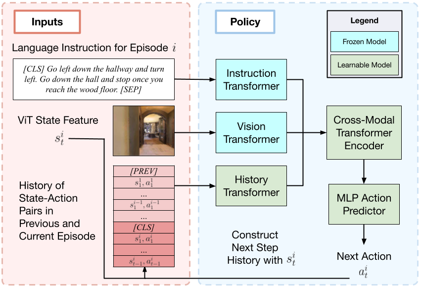

# Iterative Vision-and-Language Navigation (IVLN part)

[Jacob Krantz*](https://jacobkrantz.github.io), [Shurjo Banerjee*](https://shurjobanerjee.github.io), [Wang Zhu](https://billzhu.me), [Jason Corso](https://web.eecs.umich.edu/~jjcorso), [Peter Anderson](https://panderson.me), [Stefan Lee](http://web.engr.oregonstate.edu/~leestef), and [Jesse Thomason](https://jessethomason.com)

[[Paper](https://arxiv.org/abs/2210.03087)] [[Project Page](https://jacobkrantz.github.io/ivln)] [[GitHub (R2R part)](https://github.com/Bill1235813/IVLN)] [[GitHub (VLN-CE part)](https://github.com/jacobkrantz/IVLN-CE)]

This is the official implementation of **Iterative Vision-and-Language Navigation (IVLN) in discrete environments**, 
a paradigm for evaluating language-guided agents navigating in a persistent environment over time. 
Existing Vision-and-Language Navigation (VLN) benchmarks erase the agent’s memory at the beginning of every episode, 
testing the ability to perform cold-start navigation with no prior information. 
However, deployed robots occupy the same environment for long periods of time. 
The IVLN paradigm addresses this disparity by training and evaluating VLN agents that maintain memory across tours of scenes that consist of up to 100 ordered instruction-following Room-to-Room (R2R) episodes each defined by an individual language instruction and a target path. 
This repository implements the **Iterative Room-to-Room (IR2R)** benchmark.

## Installation

1. Install requirements:
```setup
conda create --name vlnhamt python=3.8.5
conda activate vlnhamt
pip install torch==1.7.1+cu101 torchvision==0.8.2+cu101 torchaudio==0.7.2 -f https://download.pytorch.org/whl/torch_stable.html
pip install -r requirements.txt
```
2. Download R2R data from [Dropbox](https://www.dropbox.com/sh/3a5j03u286px604/AABNp887W7_Fhgv13gUt4wzda?dl=0), including processed annotations, features and pretrained models. Put the data under *datasets* directory.

3. Download Matterport 3D adjacency maps and angle features from [Dropbox](https://www.dropbox.com/sh/1jibefgj956rjbp/AAAx-ATXwrPk6NlLKFUW6DFsa?dl=0). Put the files under *datasets* directory. 
4. Download the tour files for the original VLN-R2R and the prevalent augmented data from [GDrive](https://drive.google.com/drive/folders/1pALNPuAdSxtAKpUel9BNuy0Dn11_PZNP?usp=sharing). Put the files under the *iterative-vln* directory. The directory structure after this will be like
```directory
iterative-vln
|___finetune_src
|___datasets
|   |___R2R
|   |___total_adj_list.json
|   |___angle_feature.npy
|   |___...
|___tours_iVLN.json
|___tours_iVLN_prevalent.json
|___...
```


## Run the HAMT baseline
HAMT Teacher-forcing IL
```baseline
cd finetune_src
bash scripts/run_r2r_il.sh
```


## Run the TourHAMT model

```tour_hamt
cd finetune_src
bash scripts/iter_train_sep_hist_weight.sh
```

Model architecture:

<p align="center">
  
</p>

## TourHAMT Variations

```var_tour_hamt
cd finetune_src
bash scripts/iter_train.sh                  # extended memory with prev episodes only
bash scripts/iter_train_hist.sh             # train hist encoder
bash scripts/iter_train_sep_hist.sh         # with prev hist identifier and train hist encoder
```

## Citation
If you find this work useful, please consider citing:
```
@article{krantz2022iterative,
    title = "Iterative Vision-and-Language Navigation",
    author = "Krantz, Jacob and Banerjee, Shurjo and Zhu, Wang and Corso, Jason and Anderson, Peter and Lee, Stefan and Thomason, Jesse",
    year = "2022",
    publisher = "arXiv",
    url = {https://arxiv.org/abs/2210.03087},
}
```

## Acknowledgement
Some of the codes are built upon [HAMT](https://github.com/cshizhe/VLN-HAMT), [pytorch-image-models](https://github.com/rwightman/pytorch-image-models), [UNITER](https://github.com/ChenRocks/UNITER) and [Recurrent-VLN-BERT](https://github.com/YicongHong/Recurrent-VLN-BERT).
Thanks them for their great works!

## License
This codebase is [MIT licensed](LICENSE). Trained models and task datasets are considered data derived from the mp3d scene dataset. Matterport3D based task datasets and trained models are distributed with [Matterport3D Terms of Use](http://kaldir.vc.in.tum.de/matterport/MP_TOS.pdf) and under [CC BY-NC-SA 3.0 US license](https://creativecommons.org/licenses/by-nc-sa/3.0/us/).
